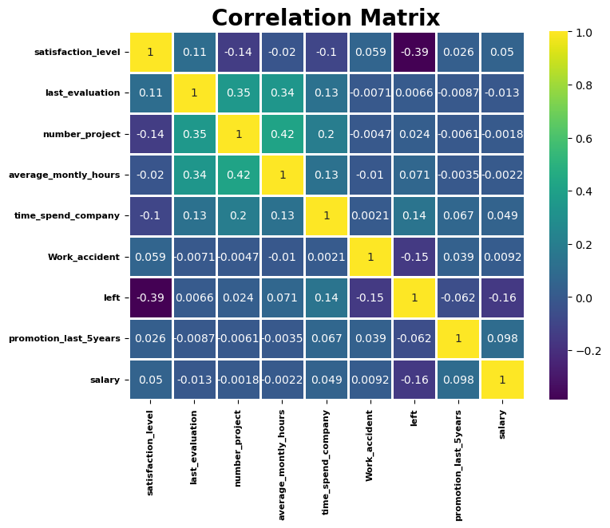

# <h1 style= 'text-size-16px; border-radius: 10px; border: 3px solid #73AD21; padding: 10px; width: 250px; height: 40px;'>Executive Summary
Employee retention remains one of the most pressing challenges in today’s competitive labor market. High turnover rates not only increase recruitment and training costs but also disrupt organizational continuity and morale. This paper explores employee retention by examining its scope, causes, and business impact. It uses a relevant dataset to uncover patterns and root causes through descriptive and diagnostic analytics, with recommendations aimed at helping organizations improve employee engagement and reduce turnover.
# Introduction
### _Employee Retention_
Employee retention refers to an organization’s ability to keep its employees over time. It is a critical aspect of workforce management, directly influencing operational efficiency, company culture, and financial performance. Retention issues often arise from dissatisfaction with leadership, limited growth opportunities, inadequate compensation, or poor work-life balance (Society for Human Resource Management [SHRM], 2022).
Scope of the Problem and Business Impact
High employee turnover costs businesses significantly. According to Gallup (2023), replacing an employee can cost one-half to two times the employee’s annual salary. For a mid-sized organization, this could mean hundreds of thousands to millions of dollars annually. Furthermore, turnover negatively affects productivity and employee morale. For instance, U.S. companies lose about $1 trillion annually due to voluntary turnover (Gallup, 2023).
# Data Exploration
### _Data Source_
Data is produced by Portobello Tech, an app innovator that has devised an intelligent way of predicting employee turnover within the company. The data source is from Kaggle at https://www.kaggle.com/datasets/akshayhedau/employee-turnover-analytics-dataset?resource=download. Data from prior evaluations show the employee’s satisfaction at the workplace. The data could be used to identify patterns in work style and their interest to continue to work in the company. The HR Department owns the data and uses it to predict employee turnover. Employee turnover refers to the total number of workers who leave a company over a certain time period. 
### _Describe the Data_
The dataset consists of 14999 rows and 10 columns:
<h3> Columns: </h1>
* satisfaction_level: From 0-1, how satisfied employees are since 
* last_evaluation: Unsure, but most likely from 0-1, measuring employee performance
* number_project = From 2-7, how many project the employee has work on
* average_monthly_hours = Average number of hours worked each month
* time_spend_company = How long they have been at the company in years
* Work_accident = If the employee has had an accident at work
* left = If the employee has left the company
* promotion_last_5years = If the employee has had a promotion in the last 5 years
* sales = Unsure, but most likely the role within sales that each employee works in
* salary = employee salary

#### _First 5 rows of the dataset_

# Analytical Techniques
### _Descriptive Analytics_
Trends and Patterns
Expected analysis: Use frequency counts, distributions, and cross-tabulations. You’ll likely observe that:
•	Younger employees and those with fewer years at the company have higher attrition.
•	Roles with high travel requirements or lower job satisfaction correlate with higher turnover.
•	Departments like Sales or Human Resources might show higher attrition rates.
### _Diagnostic Analytics_
Causes of Issues
Expected analysis: Multivariate analysis and correlation. Common findings include:
•	Low job satisfaction and poor work-life balance are strong predictors of attrition.
•	Employees with lower income or fewer opportunities for promotion are more likely to leave.
What to look for in Python:
•	Heatmaps of correlations
•	Logistic regression to quantify feature importance
•	Decision trees or SHAP values for explainability

### _Exploratory Visualization_
Suggestions:
•	Bar chart of attrition rate by job role
•	Box plots comparing monthly income between those who stayed and those who left
•	Heatmap showing correlation of variables with attrition
Use seaborn and matplotlib libraries to create these visuals.

# Insights and Recommendations
### _Actionable Insights_
Based on expected trends:
•	Employees with less tenure, lower salaries, and poor job satisfaction are most likely to leave.
•	Work-life balance and career development opportunities are consistent drivers of retention.
### _Solutions and Strategies_
Recommendations include:
•	Implement targeted retention strategies such as mentorship for new employees.
•	Increase transparency around career progression and provide continuous learning.
•	Use predictive analytics models to identify at-risk employees early and intervene (SHRM, 2022).
Communication
# Findings
Create dashboards or infographics that highlight:
•	Top 5 features most associated with attrition
•	Summary of employee demographics vs. attrition likelihood
•	“What-if” scenarios using model predictions
Ensure visuals are intuitive for a non-technical audience by minimizing jargon and emphasizing takeaways.
# Conclusion
Employee retention is both a human and business imperative. With the right data and analytics, organizations can understand why employees leave and implement strategies to increase engagement and loyalty. By proactively addressing root causes, companies can create a more stable and productive workforce. 
# References
Gallup. (2023). The True Cost of Employee Turnover. https://www.gallup.com/workplace
Society for Human Resource Management (SHRM). (2022). Managing for Employee Retention. https://www.shrm.org/resourcesandtools/hr-topics/employee-relations/pages/managing-employee-retention.aspx
Kaggle. (n.d.). HR Analytics: Employee Attrition & Performance. https://www.kaggle.com/datasets/pavansubhasht/ibm-hr-analytics-attrition-dataset
 

